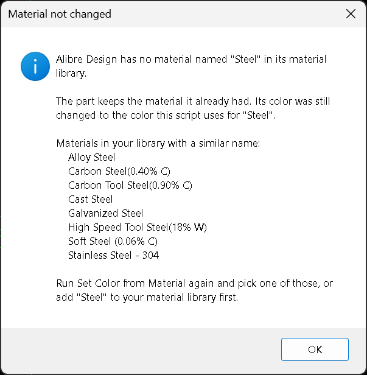

# Set Color from Material - Alibre Design Add-On

A host for the Set Color from Material Alibre Script program, published on the
Alibre Design forum:

> This is a script that @Cator wrote and others helped finalize - thanks for
> everyone's help - that will add a color when assigning material to your model.
> It has colors listed (RGB) for all the standard Alibre materials as well as
> colors that follow the KeyShot scheme. You may need to edit for your
> particular usage.
>
> <https://www.alibre.com/forum/index.php?resources/set-color-from-material.150/>

## Installation

See releases for installer.

## Troubleshooting

The add-on shows errors in a dialog and appends them to:

```
%LOCALAPPDATA%\Alibre AddOns\SetColorFromMaterial\addon.log
```

## Known Issues

If you don't have materials included with the script you will see this message.



## Additional Resources

- Forum resource page: <https://www.alibre.com/forum/index.php?resources/set-color-from-material.150/>

## Acknowledgment and License

MIT - see LICENSE.

## Credit & Citation

Script by Cator, finalized with help from the Alibre Design forum community,
published at <https://www.alibre.com/forum/index.php?resources/set-color-from-material.150/>. Add-on host by Stephen S. Mitchell.

